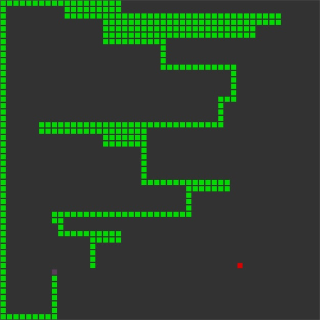

# Snake AI
Implementation of snake game in Python with Pygame.

### TODO:
- Fix bug with start collision
- Add reaction when cycle does not exist

## Installation
After cloning repo to install required packages type command:
```
python setup.py install
```
It's a good idea to do this in a virtual environment.
Then to run the application run:
```
python run.py
```

## Preview

